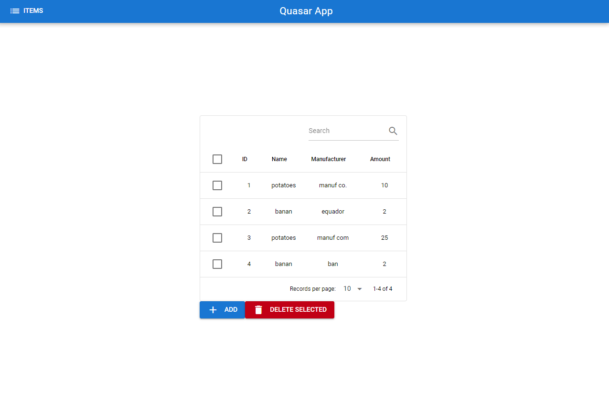

# Store fullstack

## Description
Project for managing your store's items. You can add, delete and search for items that are in your database.

## Demo



## Tech Stack

### Backend
- **NodeJS**
- **Apollo Server**
- **Prisma**
- **PostgreSQL**

### Frontend
 - **Quasar**

## Steps to launch
### Backend
Install dependencies:
```terminal
npm install
```
in psql shell:
```psql shell
CREATE DATABASE "storedb";
```
Start the server:
```
node .\index.js
```
The Apollo server will be at http://localhost:4000

### Frontend
go to quasar directory:
```
cd .\quasar-app\
```
install dependencies:
```
npm install
```
Start frontend:
```
quasar dev
```
Your frontend will be opened automatically, but if it's not so, you may find it at http://localhost:9000

#### To find the main table you need to go to 'items': http://localhost:9000/#/items